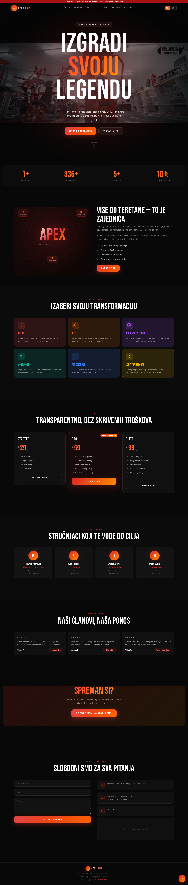

# 🏋️ APEX GYM — Premium Fitness Landing Page


> 🚀 A high-performance, conversion-focused gym landing page showcasing modern frontend development. This is a **fictional demo project** designed to demonstrate professional web development skills.

**🔗 Live Demo:** [apex-gym](https://apex-gym1.vercel.app/)

---

## 📸 Screenshot


---

## 💡 About This Project

This project demonstrates what a **modern, premium business website** looks like in 2024. Built with the latest technologies and best practices to deliver exceptional user experience across all devices.

If you're looking for a developer to build a professional website for your business — **let's connect.**

---

## ✨ Features

### 🎨 Design & UI
- Animated preloader with progress bar and custom animation
- YouTube video background hero section with gradient fallback
- Liquid glass UI elements — badges, cards, navbar
- Floating 3D cards with physics-based animations
- Animated liquid blob background effects
- Grid overlay textures
- Gradient text animations with Bebas Neue display font
- Custom branded scrollbar

### ⚡ Performance
- `IntersectionObserver` for scroll-triggered animations
- Animated number counters with viewport detection
- Preloader fully unmounts from DOM after completion
- CSS animations prioritized over JavaScript
- Single file output via `vite-plugin-singlefile`
- Fluid typography with `clamp()` — minimal media queries

### 🌍 Internationalization
- Full Serbian / English bilingual support
- Real-time language switching without page reload
- Language switcher in navbar and mobile menu

### 📱 Responsive Design
- Mobile-first approach
- Hamburger menu with smooth slide-in animation
- Touch-friendly interactive elements
- `100svh` fix for iOS Safari viewport issues
- Adaptive grid layouts for all screen sizes

### 🖱️ Hover Effects
- **Buttons:** scale, lift, glow, shake, gradient shift, pill morph
- **Cards:** float, glow border, shine sweep, tilt rotate
- **Text:** gradient color transition, sliding underline
- **Boxes:** border radius morph, rotate, multi-layer glow

### 🔍 SEO & Social
- Complete Open Graph meta tags for rich link previews
- Twitter Card support with large image
- JSON-LD structured data (GymOrFitnessCenter schema)
- Custom favicon and Apple touch icons
- Semantic HTML structure
- Optimized meta descriptions and keywords

---

## 🛠️ Tech Stack

| Technology | Version | Purpose |
|------------|---------|---------|
| React | 19.2.3 | UI component framework |
| TypeScript | 5.9.3 | Type safety |
| Vite | 7.2.4 | Build tool |
| Tailwind CSS | 4.1.17 | Utility-first styling |
| clsx | 2.1.1 | Conditional class names |
| tailwind-merge | 3.4.0 | Smart Tailwind class merging |
| vite-plugin-singlefile | 2.3.0 | Single file HTML output |

---

## 📁 Project Structure

```
apex-gym/
├── public/
│   ├── favicon.png                # Site favicon
│   ├── og-image.png               # Social media preview image
│   └── apex-gym-screenshot.png    # Project screenshot
├── src/
│   ├── utils/
│   │   └── cn.ts                  # clsx + tailwind-merge utility
│   ├── App.tsx                    # Main component — full site
│   ├── hover.css                  # Hover effect classes
│   ├── index.css                  # Tailwind CSS entry
│   └── main.tsx                   # React entry point
├── index.html                     # HTML with SEO meta tags
├── vite.config.ts                 # Vite configuration
├── tsconfig.json                  # TypeScript configuration
├── package.json                   # Dependencies
└── README.md                      # Documentation
```

---

## 🚀 Getting Started

### Prerequisites
- Node.js `>= 22.12.0`
- npm `>= 8.0.0`

### Installation

```bash
# Clone the repository
git clone https://github.com/anunnaki7/apex-gym.git

# Navigate to project folder
cd apex-gym

# Install dependencies
npm install

# Start development server
npm run dev
```

### Production Build

```bash
npm run build
```

### Preview Production Build

```bash
npm run preview
```

---

## 📄 Site Sections

| Section | ID | Description |
|---------|----|-------------|
| Hero | `#home` | Video background, headline, CTA buttons |
| Stats | — | Animated counters (years, members, trainers) |
| About | `#o-nama` | Story, features, visual element |
| Programs | `#programi` | 6 training programs with icons |
| Pricing | `#cijene` | 3 membership plans |
| Trainers | `#treneri` | 4 trainer profiles |
| Testimonials | — | Member success stories |
| CTA | — | Call-to-action section |
| Contact | `#kontakt` | Contact form and info cards |
| Footer | — | Logo and links |

---

## ⚡ Performance

| Metric | Score |
|--------|-------|
| Performance | 🟢 90+ |
| Accessibility | 🟢 90+ |
| Best Practices | 🟢 95+ |
| SEO | 🟢 90+ |

**Optimizations:**
- ✅ IntersectionObserver for efficient scroll detection
- ✅ GPU-accelerated CSS animations
- ✅ Fluid typography with clamp()
- ✅ Preconnect hints for external resources
- ✅ Single file output — zero extra network requests
- ✅ Optimized font loading strategy

---

## 🎨 Design System

### Colors

| Name | Hex | Usage |
|------|-----|-------|
| Background | `#080808` | Main background |
| Surface | `#0c0c0c` | Cards, sections |
| Primary | `#dc2626` | Red accent |
| Secondary | `#ff8c00` | Orange accent |
| Text | `#ffffff` | Primary text |
| Muted | `rgba(255,255,255,0.4)` | Secondary text |

### Typography

| Font | Usage |
|------|-------|
| Bebas Neue | Headings, logo, numbers |
| Inter | Body text, UI elements |

### Breakpoints

| Name | Value |
|------|-------|
| Mobile | `< 480px` |
| Tablet | `480px – 768px` |
| Desktop | `> 768px` |
| Wide | `> 900px` |

---

## 🤝 Looking for a Developer?

This project showcases what I can build for your business.

**I create websites for:**
- 🏋️ Gyms & fitness studios
- 💈 Barbershops & salons
- 🍕 Restaurants & cafés
- 🏠 Real estate & services
- 🛒 Any business needing a web presence

**What you get:**
- ✅ Custom design — no templates
- ✅ Mobile-first, fully responsive
- ✅ Fast loading & SEO optimized
- ✅ Modern animations & interactions
- ✅ Clean, maintainable code

### 📩 Contact

[](https://github.com/anunnaki7)
[](https://nikolalutovac-portfolio.vercel.app/)

> Open to freelance projects, collaborations, and opportunities.

---

## 📝 License

MIT License — free to use, modify and distribute with attribution.

---

<div align="center">
  <sub>Built with ❤️ by <a href="https://github.com/anunnaki7">@anunnaki7</a></sub>
</div>
